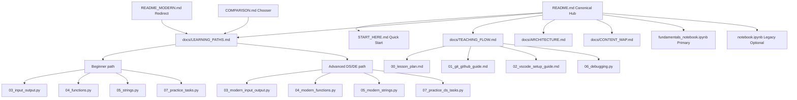

# Content Map (Canonical)

This is the source of truth for file roles in `python_core/_02`.

## File role matrix
- `README.md`: single canonical entrypoint
- `START_HERE.md`: minimal quick start only
- `docs/LEARNING_PATHS.md`: canonical path sequencing and expected outcomes
- `docs/TEACHING_FLOW.md`: canonical class flow/timing
- `docs/ARCHITECTURE.md`: DRY policy and ownership rules
- `README_MODERN.md`: redirect page
- `COMPARISON.md`: short chooser page
- `fundamentals_notebook.ipynb`: primary notebook for delivery
- `notebook.ipynb`: legacy/optional notebook

## Version policy
- Required baseline: Python 3.10-3.12
- Python 3.13 topics: optional appendix-level context only
