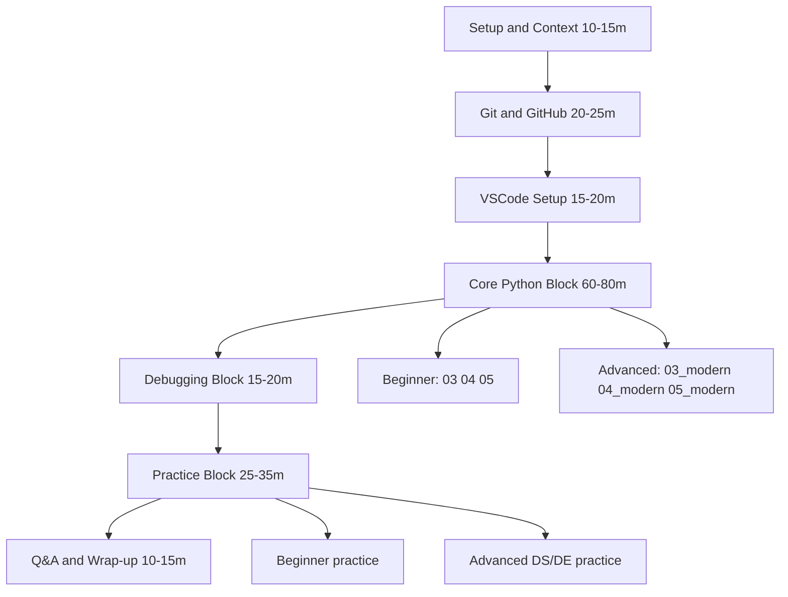

# Teaching Flow (Canonical)

This document defines the canonical class runtime flow and timing.

## Runtime guide
1. Setup and context: align expectations and baseline (Python 3.10-3.12)
2. Git/GitHub demo: commit/push/pull workflow
3. VSCode workflow: interpreter, terminal, debugger
4. Core Python block: choose one route per audience (beginner or advanced DS/DE)
5. Debugging block: use `06_debugging.py` for both routes
6. Practice block: `07_practice_tasks.py` or `07_practice_ds_tasks.py`
7. Q&A and wrap-up: connect to next modules and homework

## Guardrails
- Do not run both tracks as full parallel curricula in one short session.
- Keep one selected route primary; use the other as optional follow-up.
- Keep preview language features out of required outcomes.
