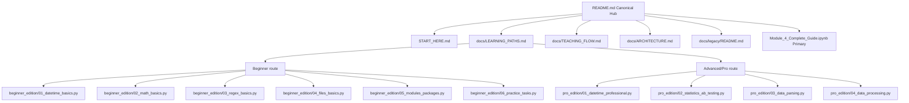

# Content Map (Canonical) — Module 4

## Ролі файлів
- `README.md`: єдиний вхід
- `START_HERE.md`: коротка стартова інструкція
- `docs/LEARNING_PATHS.md`: порядок вивчення
- `docs/TEACHING_FLOW.md`: таймінг заняття
- `docs/ARCHITECTURE.md`: DRY-правила
