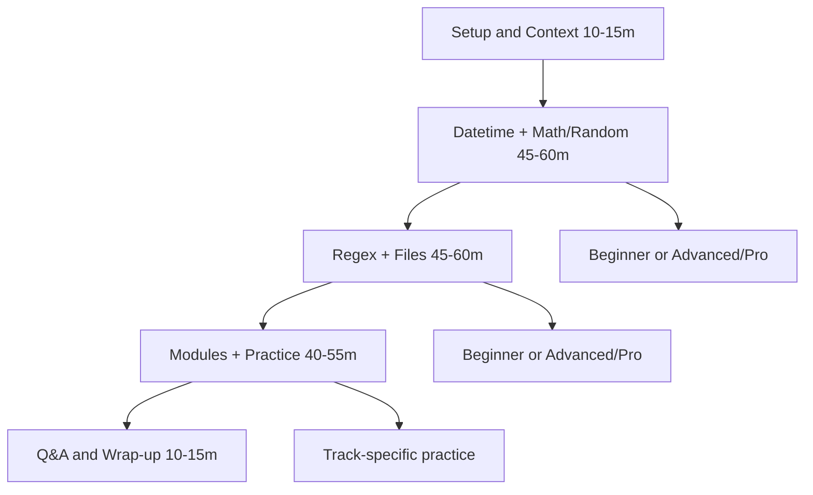

# Teaching Flow (Canonical) — Module 4

## Правила
1. Один primary route на сесію.
2. Не дублювати повний material другого треку в межах одного таймслоту.
3. Практика має завершуватися runnable результатом.
