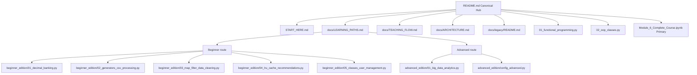

# Content Map (Canonical) — Module 6

```mermaid
graph TD
  A[README.md Canonical Hub] --> B[START_HERE.md]
  A --> C[docs/LEARNING_PATHS.md]
  A --> D[docs/TEACHING_FLOW.md]
  A --> E[docs/ARCHITECTURE.md]
  A --> F[docs/legacy/README.md]

  A --> R1[01_functional_programming.py]
  A --> R2[02_oop_classes.py]

  C --> G[Beginner route]
  C --> H[Advanced route]

  G --> G1[beginner_edition/01_decimal_banking.py]
  G --> G2[beginner_edition/02_generators_csv_processing.py]
  G --> G3[beginner_edition/03_map_filter_data_cleaning.py]
  G --> G4[beginner_edition/04_lru_cache_recommendations.py]
  G --> G5[beginner_edition/05_classes_user_management.py]

  H --> H1[advanced_edition/01_big_data_analytics.py]
  H --> H2[advanced_edition/config_advanced.py]

  A --> N[Module_6_Complete_Course.ipynb Primary]
```
