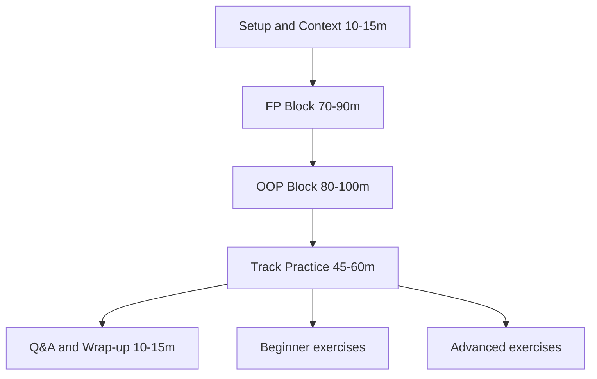

# Teaching Flow (Canonical) — Module 6

```mermaid
flowchart TD
  A[Setup and Context 10-15m] --> B[FP Block 70-90m]
  B --> C[OOP Block 80-100m]
  C --> D[Track Practice 45-60m]
  D --> E[Q&A and Wrap-up 10-15m]

  D --> D1[Beginner exercises]
  D --> D2[Advanced exercises]
```

## Правила
1. Root demos спільні для всіх.
2. Практика адаптується під обраний трек.
3. Не дублювати повний beginner+advanced у межах одного часу.
