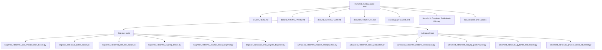

# Content Map (Canonical) — Module 8

```mermaid
graph TD
  A[README.md Canonical Hub] --> B[START_HERE.md]
  A --> C[docs/LEARNING_PATHS.md]
  A --> D[docs/TEACHING_FLOW.md]
  A --> E[docs/ARCHITECTURE.md]
  A --> F[docs/legacy/README.md]

  C --> G[Beginner route]
  C --> H[Advanced route]

  G --> G1[beginner_edition/01_oop_encapsulation_basics.py]
  G --> G2[beginner_edition/02_pickle_basics.py]
  G --> G3[beginner_edition/03_json_csv_basics.py]
  G --> G4[beginner_edition/04_copying_basics.py]
  G --> G5[beginner_edition/05_practice_tasks_beginner.py]
  G --> G6[beginner_edition/06_mini_projects_beginner.py]

  H --> H1[advanced_edition/01_modern_encapsulation.py]
  H --> H2[advanced_edition/02_pickle_production.py]
  H --> H3[advanced_edition/03_modern_serialization.py]
  H --> H4[advanced_edition/04_copying_performance.py]
  H --> H5[advanced_edition/05_pydantic_dataclasses.py]
  H --> H6[advanced_edition/06_practice_tasks_advanced.py]

  A --> N[Module_8_Complete_Guide.ipynb Primary]
  A --> DSET[data/ datasets and samples]
```
