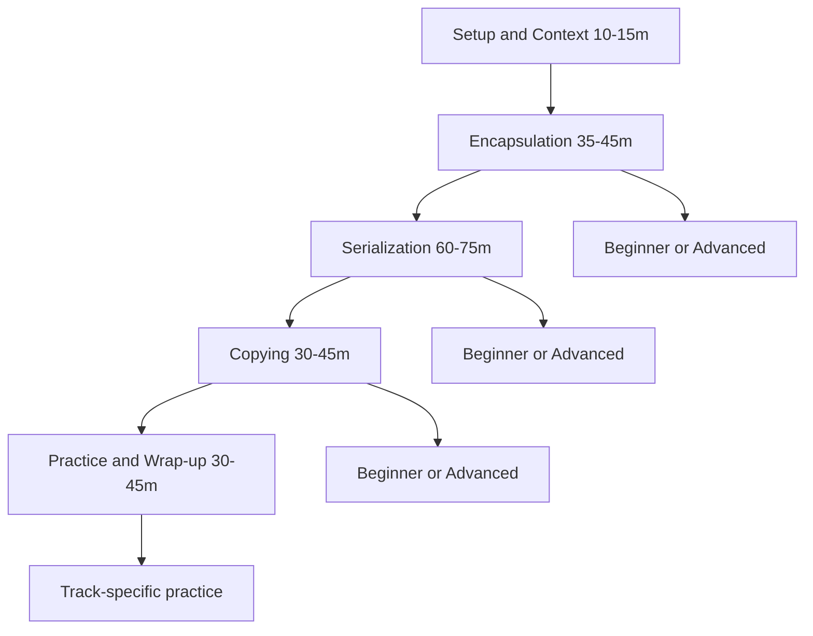

# Teaching Flow (Canonical) — Module 8

## Правила
1. Один primary route на конкретну сесію.
2. Другий route залишається optional/self-study.
3. Акцент на безпеку: `pickle` лише для trusted inputs.
